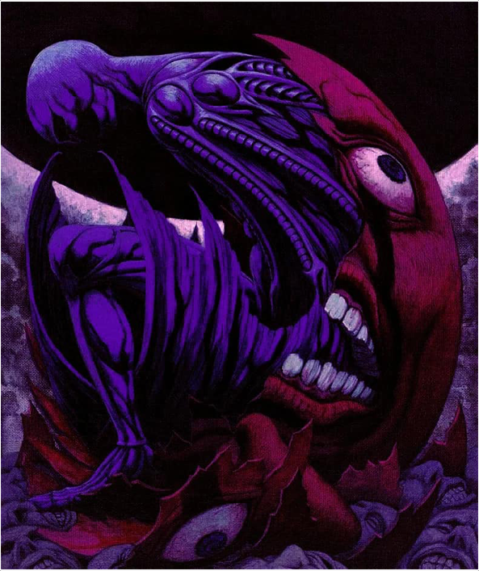

  
  
   
  <!--
    
  
  
  -->
  
  <!--
    
  
  -->
  

[ Hi, I'm **John Carlo** 👋 ]  
- 🎓 Student Developer

 

[ **About Me** ]  
- I'm an IT student with a strong interest in building, breaking, and understanding systems.  
- I mainly use GitHub for learning, experiments, and improving my skills through hands-on projects.

 

[ **Interests** ]  
- 🌐 Web Development  
- 🎮 Game Development  
- 🛠️ Open-source Tools  
- 🤖 Automation & Scripting

 

[ **Tech Stack** ]  

- Languages:

 
 
 
 
 
 
 
 
 
 

- Tools:

 
 
 

